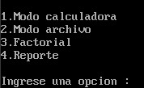
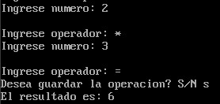
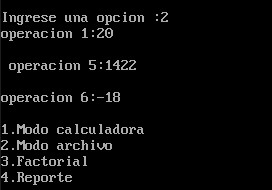

Manual de usuario
==============
#### Universidad de San Carlos de Guatemala
#### Facultad de Ingeniería
#### Arquitectura de computadoras y Ensambladores 1
#### Sección A
#### Segundo Semestre 2023

- [Introduccion](#1.0)
- [Inicio del programa](#2.0)
- [Modo calculadora](#3.0)
- [Modo archivo](#4.0)
- [Factorial](#5.0)
- [Reporte](#6.0)

## 1.0 Introducción 
La aplicacion permite ejecutar operaciones aritméticas en 2 modos diferentes.

## 2.0 Inicio del programa
Al principio de la ejecucion se muestra el menú principal mostrando las 4 opciones que permite la aplicacion. Estas son el: Modo calculadora, Modo archivo, Modo Factorial y finalmente generar un reporte con las operaciones guardadas en el modo calculadora.

## 3.0 Modo calculadora
El modo calculadora permite calcular las 4 operaciones fundamentales de la aritmética con numeros de un digito.

El modo se comporta de la siguiente manera: Se pide al usuario el primero digito, al presionar la tecla enter se pide ingresar el operando, seguido de esto se solicita el segundo numero, este proceso se repite hasta que se coloque el simbolo "=". Finalmente se pregunta al usuario si desea guardar la operacion. 

## 4.0 Modo archivo
Este modo permite abrir una archivo y ejecutar el conjunto de operaciones que contenga dicho archivo. Las operaciones en este modo deben estar en prefijo, por ejemplo 1+2*3 (+ 1 * 2 3)

## 5.0 Factorial
Este modo permite calcular el factorial de 0 a 4.

## 6.0 Reporte
Este se genera de las operacions guardadas en el modo calculadora. Este se genera en formato html.
